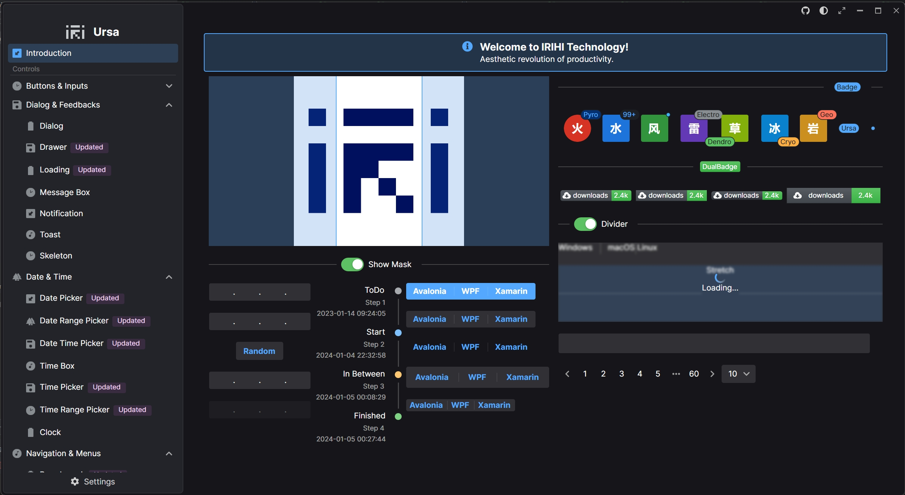

# Ursa

[English](README.md) | 简体中文

<p align="center">
    
</p>

[](https://www.nuget.org/packages/Irihi.Ursa/)
[](https://www.nuget.org/packages/Irihi.Ursa/)
[](https://gitcode.com/IRIHI_Technology/Ursa.Avalonia)

Ursa 是一个企业级 Avalonia UI 库，助力开发者快速构建跨平台应用程序。



## .NET 基金会

本项目由 [.NET 基金会](https://dotnetfoundation.org) 支持。

## 快速开始

1. Ursa

添加 nuget 包：
```bash
dotnet add package Irihi.Ursa
```

2. Ursa.Themes.Semi

为了让 Ursa 控件在您的应用程序中显示，您需要引用为 Ursa 设计的主题包。
Ursa.Themes.Semi 是受 Semi Design 启发的 Ursa 主题包。您可以通过以下步骤将其添加到您的项目中。

添加 nuget 包：
```bash
dotnet add package Semi.Avalonia
dotnet add package Irihi.Ursa.Themes.Semi
```

在应用程序中包含样式：
```xaml
<Application...
    xmlns:semi="https://irihi.tech/semi"
    xmlns:u-semi="https://irihi.tech/ursa/themes/semi"
    ....>

    <Application.Styles>
        <semi:SemiTheme Locale="zh-CN" />
        <u-semi:SemiTheme Locale="zh-CN"/>
    </Application.Styles>
    ...
```


现在您可以在 Avalonia 应用程序中使用 Ursa 控件了。
```xaml
<Window
    ...
    xmlns:u="https://irihi.tech/ursa"
    ...>
    <StackPanel Margin="20">
        <u:TagInput />
    </StackPanel>
</Window>
```


## 行为准则

本项目采用了由贡献者公约定义的行为准则，以明确社区的预期行为。
有关更多信息，请参阅 [.NET 基金会行为准则](https://dotnetfoundation.org/code-of-conduct)。

## 兼容性说明
Ursa 目前兼容 Avalonia 11.1.x 到 11.3.x，但明确不支持 Avalonia 11.2.0。

## 扩展

### Prism 扩展
如果您需要将 Ursa 与 Prism.Avalonia 集成，可以使用 Irihi.Ursa.PrismExtension 包。该包提供对话框相关服务，以便以 Prism 风格使用 Ursa 对话框。

### ReactiveUI 扩展
如果需要将 Ursa 与 ReactiveUI.Avalonia 集成，可以使用 Irihi.Ursa.ReactiveUIExtension 包。该包实现了 UrsaWindow 和 UrsaView 的 ReactiveUI 版本。详细信息请参阅 [wiki](https://github.com/irihitech/Ursa.Avalonia/wiki/Ursa-ReactiveUI-extension)。

## 支持

我们为 Semi Avalonia 和 Ursa 提供有限的免费社区支持。请通过飞书加入我们的群组

<p>
    
</p>
